# Backlog Chef: Executive Pitch Deck

## Transform Meeting Chaos into Sprint-Ready Backlog Items

---

## The Problem: $3 Billion in Lost Productivity

### Every refinement meeting produces:
- 2-3 hours of manual work AFTER the meeting
- Incomplete requirements that slip through
- Missing acceptance criteria discovered mid-sprint
- Lost context from "we discussed this somewhere"
- Inconsistent quality across teams

### The Real Cost:
- **Development teams**: 20-30% of sprint capacity wasted on clarification
- **Product Owners**: Endless follow-up questions
- **Stakeholders**: Repeated meetings to fix what was missed
- **Business**: Features delayed by 2-3 sprints due to incomplete refinement

```mermaid
%%{init: {'theme':'base', 'themeVariables': { 'fontSize':'18px', 'fontFamily':'arial', 'primaryColor':'#4CAF50', 'primaryTextColor':'#fff', 'primaryBorderColor':'#2E7D32', 'lineColor':'#333', 'secondaryColor':'#FFC107', 'tertiaryColor':'#f44336'}}}%%
graph LR
    A["Refinement Meeting<br/>(1 hour)"] --> B["Manual Work<br/>(2-3 hours)"]
    B --> C["Incomplete PBIs<br/>Entered Sprint"]
    C --> D["Mid-Sprint<br/>Clarifications"]
    D --> E["Delays & Rework<br/>(20-30% capacity lost)"]

    style A fill:#4CAF50,stroke:#2E7D32,stroke-width:4px,color:#fff
    style B fill:#FFC107,stroke:#F57C00,stroke-width:4px,color:#000
    style C fill:#FFC107,stroke:#F57C00,stroke-width:4px,color:#000
    style D fill:#f44336,stroke:#C62828,stroke-width:4px,color:#fff
    style E fill:#f44336,stroke:#C62828,stroke-width:4px,color:#fff
```

---

## The Backlog Chef Solution

### Not Another Transcription Tool. An Intelligent Refinement Assistant.

Backlog Chef transforms Scrum refinement meetings into **sprint-ready Product Backlog Items** with built-in quality assurance, risk detection, and stakeholder intelligence.

### What Makes Us Different:

**Domain-Specific Intelligence**
- Built for Agile/Scrum workflows, not generic transcription
- Understands PBIs, acceptance criteria, Definition of Ready
- Knows the difference between a decision, question, and assumption

**Quality Assurance Built-In**
- Confidence scoring prevents incomplete requirements
- Flags missing information BEFORE sprint commitment
- Multi-dimensional readiness assessment

**Actionable, Not Just Informational**
- Generates questions WITH proposed answers
- Finds similar past work (estimates, risks, lessons)
- Routes questions to appropriate stakeholders automatically

**Your Data, Your Control**
- Self-hosted AI options (on-premise LLMs)
- Enterprise data sovereignty
- Zero vendor lock-in with modular architecture

---

## How It Works: 8-Step Intelligence Pipeline

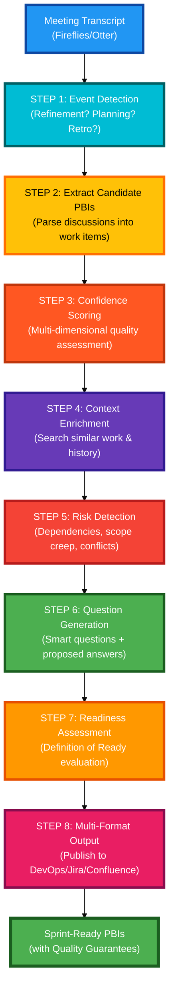

### Detailed Pipeline View

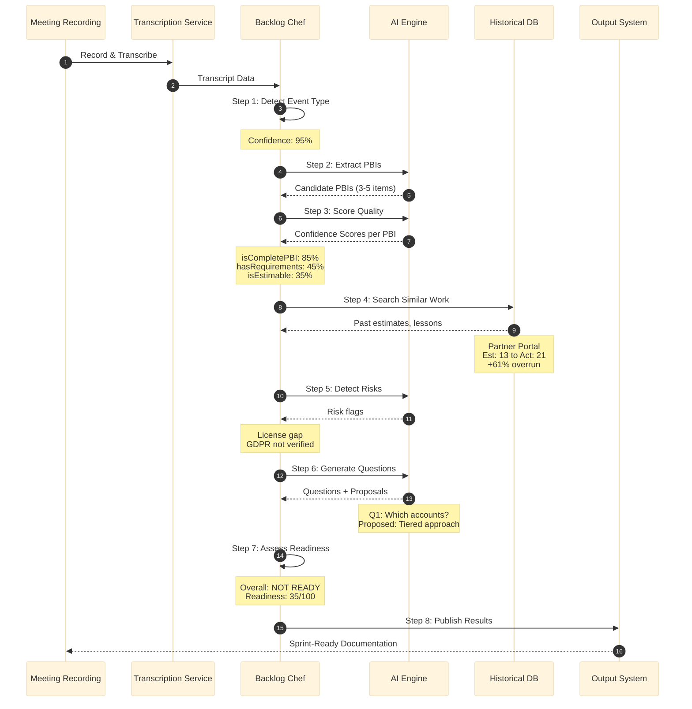

---

## Quality Scoring Visualization

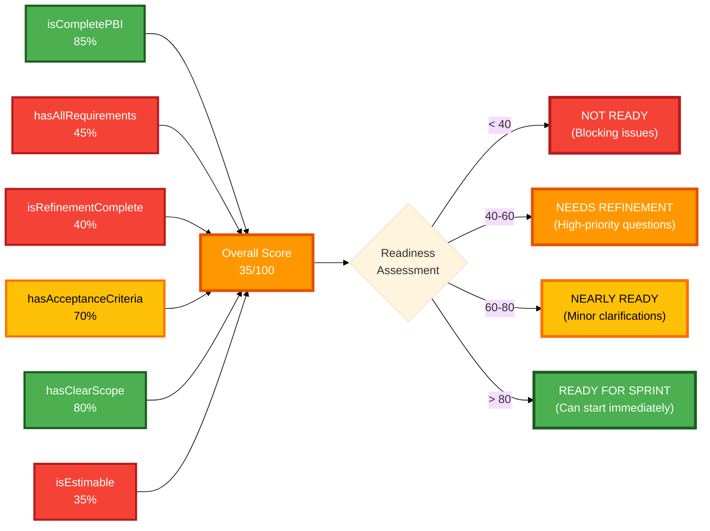

---

## Data Sovereignty: The Killer Feature

### Three Deployment Options

```mermaid
%%{init: {'theme':'base', 'themeVariables': { 'fontSize':'15px'}}}%%
graph TB
    subgraph Cloud["OPTION 1: CLOUD AI - Quick Start"]
        C1["Your Meeting"] --> C2["Your Server"]
        C2 --> C3["Claude API<br/>(SOC2 Compliant)"]
        C3 --> C4["Results"]

        style C1 fill:#2196F3,stroke:#0D47A1,stroke-width:3px,color:#fff
        style C2 fill:#00BCD4,stroke:#006064,stroke-width:3px,color:#fff
        style C3 fill:#673AB7,stroke:#311B92,stroke-width:3px,color:#fff
        style C4 fill:#4CAF50,stroke:#1B5E20,stroke-width:3px,color:#fff
    end

    subgraph SelfHost["OPTION 2: SELF-HOSTED - Maximum Control"]
        S1["Your Meeting"] --> S2["Your Server"]
        S2 --> S3["Your LLM<br/>(Llama 3 / Mistral)"]
        S3 --> S4["Results"]
        S5["No External Calls"] -.-> S3

        style S1 fill:#2196F3,stroke:#0D47A1,stroke-width:3px,color:#fff
        style S2 fill:#00BCD4,stroke:#006064,stroke-width:3px,color:#fff
        style S3 fill:#4CAF50,stroke:#1B5E20,stroke-width:3px,color:#fff
        style S4 fill:#4CAF50,stroke:#1B5E20,stroke-width:3px,color:#fff
        style S5 fill:#FFC107,stroke:#FF6F00,stroke-width:2px,color:#000
    end

    subgraph Hybrid["OPTION 3: HYBRID - Best of Both"]
        H1["Your Meeting"] --> H2["Smart Router"]
        H2 -->|Sensitive| H3["Local LLM"]
        H2 -->|Complex| H4["Cloud AI"]
        H3 --> H5["Results"]
        H4 --> H5

        style H1 fill:#2196F3,stroke:#0D47A1,stroke-width:3px,color:#fff
        style H2 fill:#FF9800,stroke:#E65100,stroke-width:3px,color:#fff
        style H3 fill:#4CAF50,stroke:#1B5E20,stroke-width:3px,color:#fff
        style H4 fill:#673AB7,stroke:#311B92,stroke-width:3px,color:#fff
        style H5 fill:#4CAF50,stroke:#1B5E20,stroke-width:3px,color:#fff
    end
```

### Why This Matters

| Who | Requirement | Solution |
|-----|-------------|----------|
| **Financial Services** | GDPR, SOX, PCI compliance | Self-hosted, air-gapped deployment |
| **Manufacturing** | Trade secrets, IP protection | On-premise LLMs, no external calls |
| **Government** | National security, classified data | Air-gapped, complete data control |
| **Multinational** | Data residency per region | Hybrid deployment per jurisdiction |

---

## Competitive Landscape

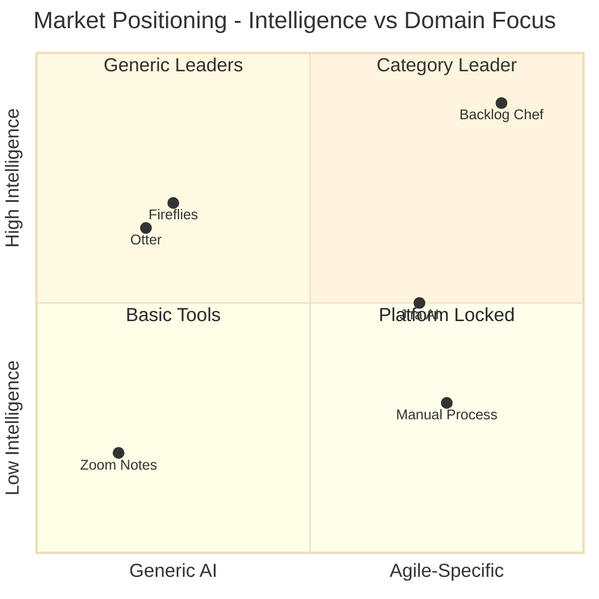

### Feature Comparison Matrix

| Feature | Backlog Chef | Fireflies | Jira AI | Manual |
|---------|:------------:|:---------:|:-------:|:------:|
| Agile-Specific | ✅ | ❌ | ✅ | ⚠️ |
| Quality Scoring | ✅ | ❌ | ❌ | ❌ |
| Risk Detection | ✅ | ❌ | ❌ | ⚠️ |
| Historical Intelligence | ✅ | ❌ | ⚠️ | ❌ |
| Question Generation | ✅ | ❌ | ❌ | ✅ |
| Proposed Answers | ✅ | ❌ | ❌ | ❌ |
| Multi-Tool Output | ✅ | ⚠️ | ❌ | ✅ |
| Self-Hosted AI | ✅ | ❌ | ❌ | N/A |
| **Cost (per team/month)** | **€49** | **$35** | **Bundled** | **Hidden** |

---

## Target Markets & ROI

```mermaid
%%{init: {'theme':'base', 'themeVariables': { 'fontSize':'15px'}}}%%
graph TB
    Market["Target Markets"]

    Market --> Primary["PRIMARY: Software Dev Teams<br/>(10-100 people)"]
    Market --> Secondary["SECONDARY: Enterprise<br/>(Banks, Insurance, Telcos)"]
    Market --> Tertiary["TERTIARY: Consulting Firms<br/>(Agencies)"]

    Primary --> P1["Pain: Manual work 2-3 hrs per meeting"]
    Primary --> P2["Value: 80% time reduction"]
    Primary --> P3["Price: EUR 49-149/month"]
    Primary --> P4["ROI: USD 28k/year savings"]

    Secondary --> S1["Pain: Compliance & audit trails"]
    Secondary --> S2["Value: Data sovereignty"]
    Secondary --> S3["Price: EUR 5k-50k/month"]
    Secondary --> S4["Features: Self-hosted, SSO"]

    Tertiary --> T1["Pain: Multi-client context switching"]
    Tertiary --> T2["Value: Consistent quality"]
    Tertiary --> T3["Price: EUR 149-499/month"]
    Tertiary --> T4["Benefit: Knowledge retention"]

    style Primary fill:#4CAF50,stroke:#1B5E20,stroke-width:3px,color:#fff
    style Secondary fill:#2196F3,stroke:#0D47A1,stroke-width:3px,color:#fff
    style Tertiary fill:#FF9800,stroke:#E65100,stroke-width:3px,color:#fff
    style Market fill:#673AB7,stroke:#311B92,stroke-width:4px,color:#fff
```

### ROI Calculation (8-Person Team)

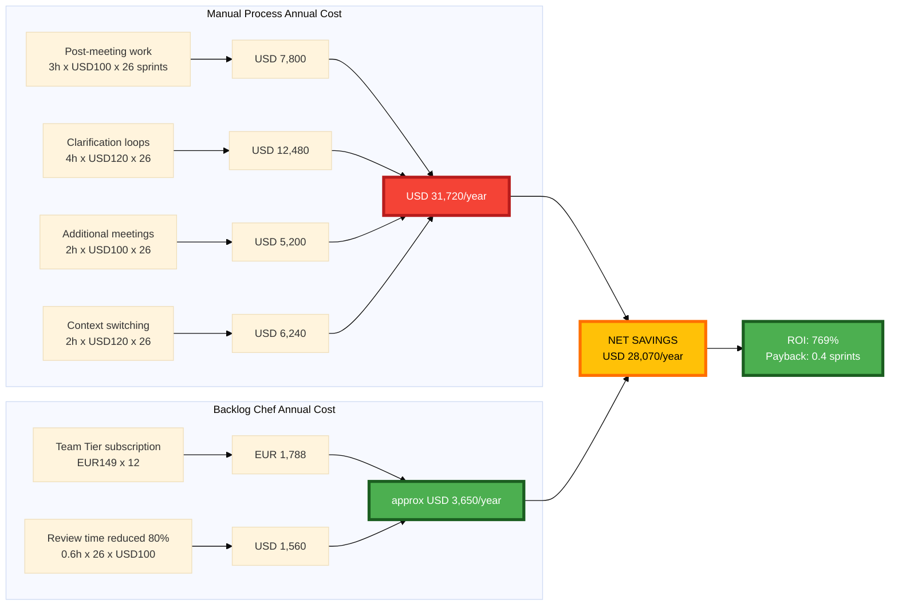

---

## Business Model & Pricing Tiers

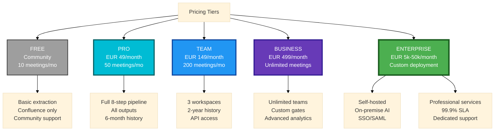

### Revenue Projections

**Year 1:** EUR 38k ARR (50 Pro, 5 Team)
**Year 2:** EUR 563k ARR (500 Pro, 50 Team, 10 Business, 2 Enterprise)
**Year 3:** EUR 2.4M ARR (2000 Pro, 200 Team, 50 Business, 10 Enterprise)

---

## Customer Journey

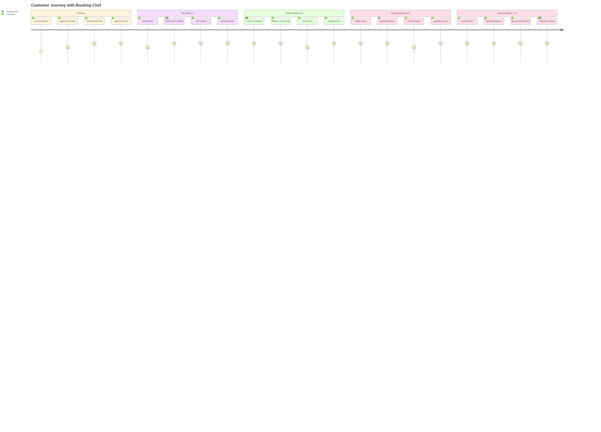

---

## Implementation Roadmap

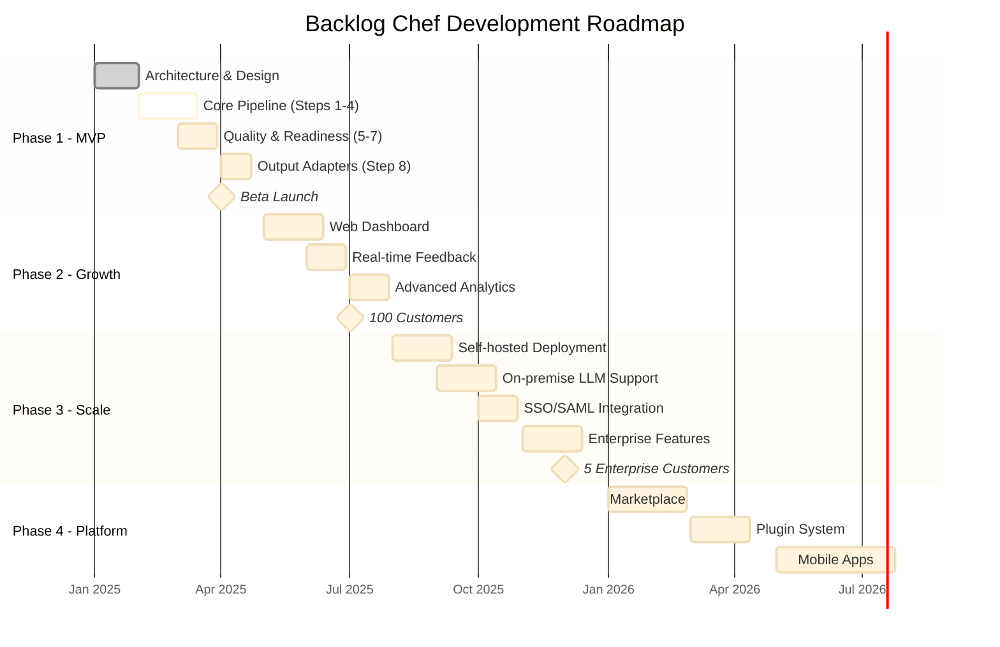

---

## Competitive Moat

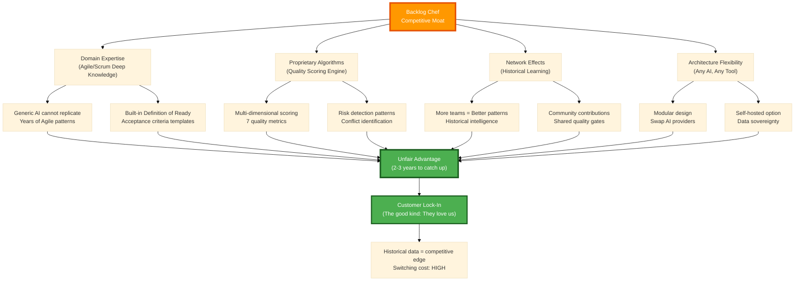

---

## Architecture Overview (PlantUML)

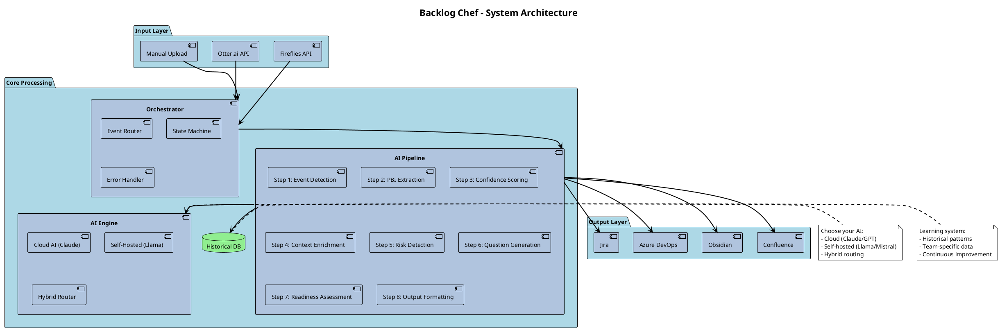

---

## Deployment Architecture (PlantUML)

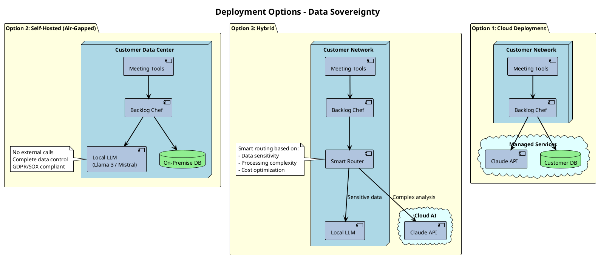

---

## The Ask & Investment

**Seed Round: EUR 250k-500k**

### Use of Funds:
- **60% Engineering** (EUR 150k-300k) - 1 Full-stack Engineer, 1 Product Designer, Infrastructure
- **25% Customer Acquisition** (EUR 62k-125k) - Content marketing, paid ads, partnerships
- **10% Operations** (EUR 25k-50k) - Legal, accounting, SaaS tools
- **5% Reserve** (EUR 13k-25k) - Contingency

### Expected Milestones (6 Months):
1. **Months 1-2:** MVP development, core pipeline complete, Fireflies + DevOps integration
2. **Months 3-4:** Beta launch with 10 early adopter teams, product-market fit validation
3. **Months 5-6:** 100 paying customers, EUR 5k MRR, web dashboard launched, ready for Series A

---

## Why Now?

**Technology Ready**
- Claude 3.5 / GPT-4 production-grade
- Llama 3 open models mature
- API ecosystem complete

**Market Ready**
- 79% Agile adoption globally
- Remote work normalized
- More recorded meetings than ever
- Meeting fatigue creating demand

**Regulatory Pressure**
- GDPR enforcement increasing
- AI Act coming to EU
- Data sovereignty critical
- Self-hosted demand rising

**Competition Gaps**
- Fireflies too generic
- Jira AI platform-locked
- No Agile specialist exists
- First-mover window open

---

## Team & Credentials

**Alwin van Dijken** (Founder - ApexChef)
- Salesforce/Apex Developer - Enterprise-grade systems at scale
- Former Kitchen Chef - Process optimization and quality control expertise
- Process & Automation Expert - Complex workflow automation

**Why This Team Wins:**
- Deep understanding of Agile/Scrum pain points (lived it)
- Technical expertise in AI/LLM integration (built systems)
- Enterprise software experience (scalable, secure)
- Process mindset: Chef discipline → Automation excellence

---

## Call to Action

### For Development Teams:
**Join the Beta** - 6 months free, shape the product
→ beta@backlogchef.com

### For Investors:
**Category-Defining Opportunity** - USD 20B Agile market, first-mover advantage
→ invest@backlogchef.com

### For Partners:
**Ecosystem Growth** - Atlassian marketplace, Microsoft ecosystem
→ partners@backlogchef.com

---

## Contact Information

**Backlog Chef by ApexChef**

- Website: backlogchef.com (coming soon)
- Email: hello@backlogchef.com
- Beta: beta@backlogchef.com
- Investors: invest@backlogchef.com
- Partners: partners@backlogchef.com
- LinkedIn: /company/backlog-chef
- GitHub: github.com/apexchef/backlog-chef

---

*"Stop letting bad requirements into your sprints. Start with quality."*

**Backlog Chef - Transform Meeting Chaos into Sprint-Ready Excellence**
