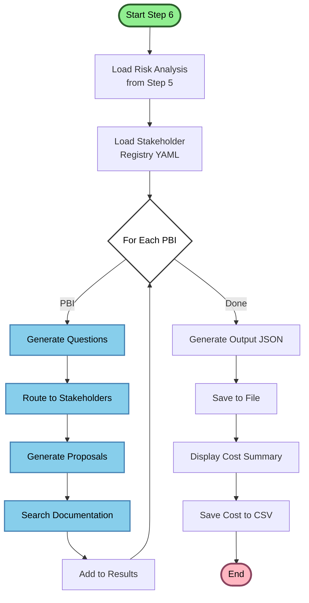
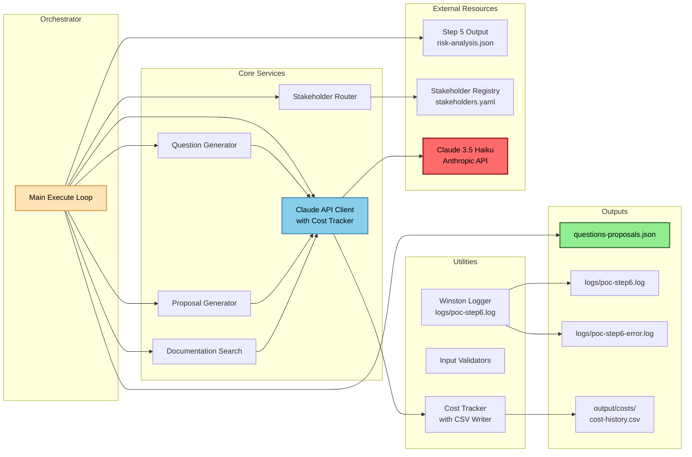
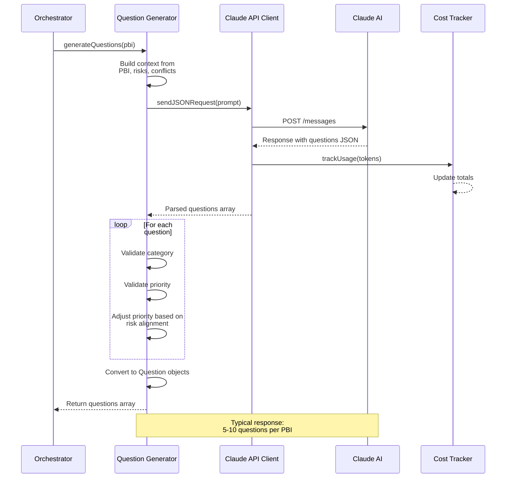
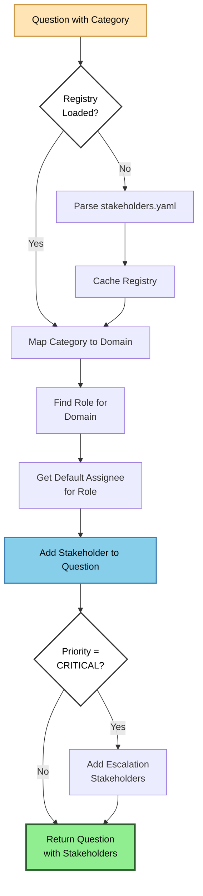
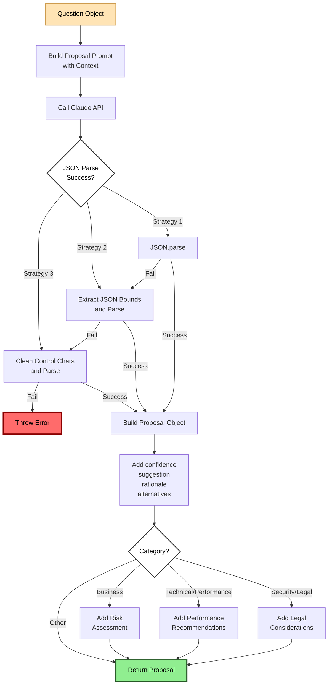
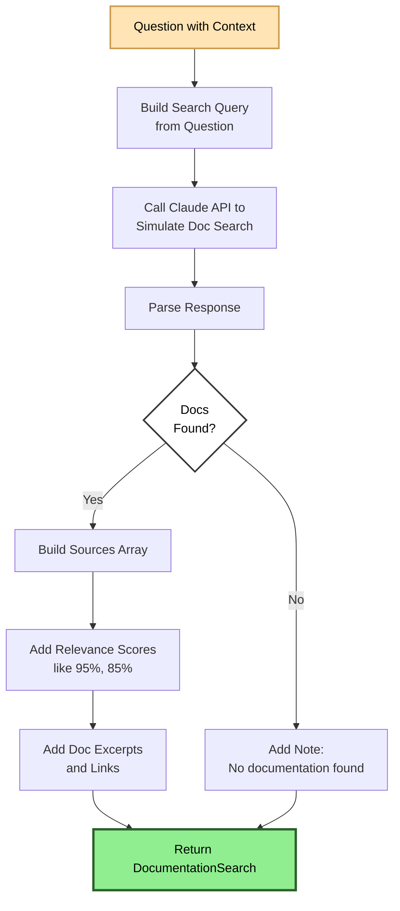
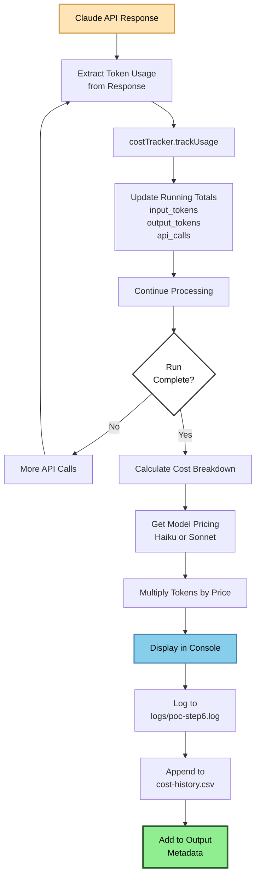
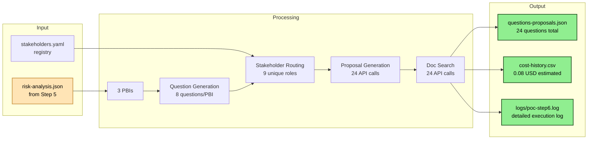
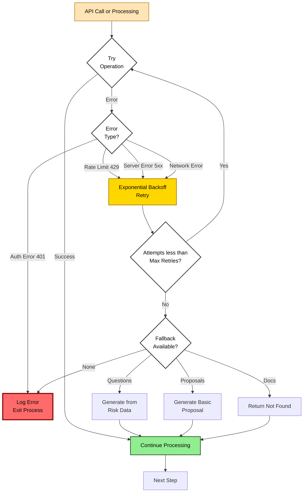

# Step 6: Technical Flow Diagram

## High-Level Overview

## Detailed Component Flow

```mermaid
graph TB
    subgraph "Main Orchestrator"
        Init[Initialize Services] --> Validate[Validate Config]
        Validate --> TestAPI[Test Claude API<br/>Connection]
        TestAPI --> LoadRA[Load Risk Analysis<br/>JSON from Step 5]
    end

    subgraph "Per-PBI Processing Loop"
        LoadRA --> QGen[Question Generator]

        QGen --> IdentifyQ[Identify Unanswered<br/>Questions via AI]
        IdentifyQ --> EnhanceQ[Enhance and Validate<br/>Questions]
        EnhanceQ --> AdjustP[Adjust Priority<br/>Based on Risks]

        AdjustP --> SRouter[Stakeholder Router]
        SRouter --> MapDomain[Map Question Category<br/>to Stakeholder Role]
        MapDomain --> AssignStake[Assign Stakeholders<br/>from Registry]

        AssignStake --> PGen[Proposal Generator]
        PGen --> GenAnswer[Generate Proposed<br/>Answer]
        GenAnswer --> AddAlternatives[Add Alternatives and<br/>Considerations]

        AddAlternatives --> DocSearch[Documentation Search]
        DocSearch --> SimSearch[Simulate Doc Search<br/>via AI]
        SimSearch --> AddSources[Add Supporting<br/>Sources]

        AddSources --> Combine[Combine into<br/>Final Question Object]
    end

    subgraph "Output Generation"
        Combine --> Aggregate[Aggregate All PBIs]
        Aggregate --> CalcMeta[Calculate Metadata<br/>and Statistics]
        CalcMeta --> AddCost[Add Cost Tracking<br/>Data]
        AddCost --> FormatJSON[Format Output JSON]
    end

    subgraph "Finalization"
        FormatJSON --> SaveFile[Save to<br/>questions-proposals.json]
        SaveFile --> LogCost[Log Cost Summary<br/>to Console and Logs]
        LogCost --> SaveCSV[Save Cost to<br/>cost-history.csv]
    end

    style Init fill:#FFE4B5,stroke:#cd9b4d,stroke-width:2px,color:#000
    style QGen fill:#B0E0E6,stroke:#5f9ea0,stroke-width:2px,color:#000
    style SRouter fill:#DDA0DD,stroke:#8b668b,stroke-width:2px,color:#000
    style PGen fill:#F0E68C,stroke:#bdb76b,stroke-width:2px,color:#000
    style DocSearch fill:#98FB98,stroke:#2e8b57,stroke-width:2px,color:#000
    style SaveFile fill:#FFB6C1,stroke:#8b4560,stroke-width:2px,color:#000
```

## Service-Level Architecture

## Question Generation Deep Dive

## Stakeholder Routing Flow

## Proposal Generation Flow

## Documentation Search Flow

## Cost Tracking Flow

## Data Flow: Input to Output

## Error Handling & Fallback Strategy

## Summary Statistics

**Typical Run Metrics:**
- **Input:** 3 PBIs from Step 5
- **Questions Generated:** Approximately 24 total (8 per PBI)
- **API Calls:** Approximately 48 total (questions + proposals + doc searches)
- **Stakeholders Identified:** Approximately 9 unique roles
- **Processing Time:** 2-3 minutes
- **Token Usage:** 50-60K total tokens
- **Estimated Cost:** $0.08-0.10 USD (using Haiku model)

**Output Files:**
1. `output/questions-proposals.json` (approximately 80KB)
2. `output/costs/cost-history.csv` (1 row per run)
3. `logs/poc-step6.log` (all logs)
4. `logs/poc-step6-error.log` (errors only)

**Color Legend:**
- 🟢 **Green:** Start/End points and successful outputs
- 🔵 **Blue:** Core processing steps
- 🟡 **Yellow:** Warning/Retry states
- 🔴 **Red:** Error states
- ⚪ **White:** Decision points
