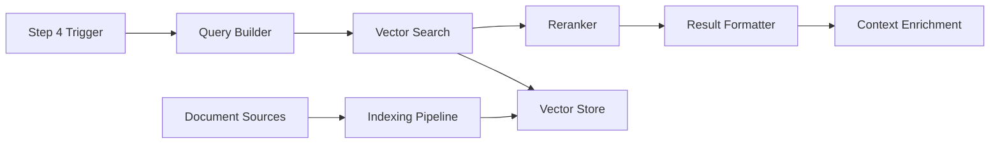

# PBI-013: RAG Context Enrichment System - Preparation Phase

## Executive Summary

This document presents comprehensive research and requirements analysis for implementing a Retrieval-Augmented Generation (RAG) system to enhance Backlog Chef's Step 4 (Enrich with Context). The RAG system will replace mock data with intelligent semantic search across historical PBIs, documentation, and external knowledge bases.

## 1. Requirements Analysis

### 1.1 Functional Requirements

#### Core Capabilities
- **Semantic Search**: Find relevant content based on meaning, not just keywords
- **Multi-Source Indexing**: Support diverse data sources (JSON, Markdown, APIs)
- **Real-time Retrieval**: Return context within performance thresholds
- **Incremental Updates**: Add new content without full re-indexing
- **Audit Trail**: Track which documents influenced each enrichment

#### Data Sources (Priority Order)
1. **Previous PBI JSON files** - Past pipeline outputs for pattern recognition
2. **Markdown documentation** - Project docs, ADRs, technical specs
3. **Confluence pages** - Team knowledge base via REST API
4. **Azure DevOps work items** - Historical tickets and implementations
5. **Custom JSON/YAML files** - Decision logs, configuration specs

#### Integration Requirements
- Replace mock data in `step4-enrich-context.ts`
- Maintain existing TypeScript interfaces and data structures
- Support current AI provider abstraction (ModelRouter)
- Work with existing pipeline context flow

### 1.2 Non-Functional Requirements

#### Performance Targets
- **Local vector search**: < 500ms response time
- **Cloud vector search**: < 2s response time
- **Indexing speed**: > 100 documents/minute
- **Memory usage**: < 2GB for local stores up to 10,000 documents

#### Scalability
- Support 10,000+ documents in initial release
- Handle documents up to 100KB each
- Concurrent search requests without degradation
- Efficient similarity scoring for top-k retrieval

#### Reliability
- Graceful degradation when vector store unavailable
- Fallback to keyword search if semantic search fails
- Recovery from partial indexing failures
- Data persistence across restarts

### 1.3 User Experience Requirements

#### CLI Commands
```bash
# Index management
backlog-chef rag index --source ./output/past-runs --type pbi
backlog-chef rag index --source ./docs --type markdown
backlog-chef rag index --source confluence --space TECH
backlog-chef rag index --source azure-devops --project MyProject

# Vector store management
backlog-chef rag init --provider chroma --path ./vector-db
backlog-chef rag status
backlog-chef rag clear
backlog-chef rag rebuild

# Search testing
backlog-chef rag search "authentication flow implementation"
```

#### Configuration
```yaml
# rag-config.yaml
rag:
  enabled: true
  provider: chroma  # chroma | faiss | pinecone | weaviate

  embedding:
    model: all-MiniLM-L6-v2  # sentence-transformers model
    dimensions: 384

  storage:
    local:
      path: ./vector-db
      persist: true
    cloud:
      api_key: ${PINECONE_API_KEY}
      environment: us-west1-gcp
      index: backlog-chef-prod

  retrieval:
    top_k: 5
    min_similarity: 0.7
    rerank: true

  sources:
    - type: pbi
      path: ./output/*/final-output.json
      auto_index: true
    - type: markdown
      path: ./docs/**/*.md
      exclude: ['**/README.md', '**/CHANGELOG.md']
    - type: confluence
      space_keys: [TECH, ARCH]
      update_frequency: daily
```

## 2. RAG Architecture Patterns Research

### 2.1 RAG System Components

#### Document Processing Pipeline
1. **Loader**: Extract text from various formats
2. **Chunker**: Split documents into semantic segments
3. **Embedder**: Convert text to vector representations
4. **Indexer**: Store vectors with metadata

#### Retrieval Pipeline
1. **Query Processor**: Parse and enhance search queries
2. **Encoder**: Convert query to vector
3. **Searcher**: Find similar vectors
4. **Reranker**: Refine results using cross-encoders
5. **Formatter**: Structure results for consumption

### 2.2 Chunking Strategies

#### Semantic Chunking (Recommended)
- Split on semantic boundaries (paragraphs, sections)
- Maintain context with sliding windows
- Preserve document structure metadata
- Chunk size: 200-500 tokens optimal for our use case

#### Benefits for Backlog Chef
- PBI descriptions stay intact
- Code blocks remain complete
- Acceptance criteria grouped logically
- Decision rationales preserved

### 2.3 Embedding Strategies

#### Dense Embeddings (Primary)
- **Model**: sentence-transformers/all-MiniLM-L6-v2
- **Dimensions**: 384 (good balance of size/quality)
- **Speed**: ~2000 sentences/second on CPU
- **Quality**: 0.63 correlation on STS benchmark

#### Hybrid Search (Enhancement)
- Combine dense embeddings with BM25 keyword search
- Weight: 70% semantic, 30% keyword
- Improves retrieval of specific terms (APIs, class names)

### 2.4 Reranking Approaches

#### Cross-Encoder Reranking
- **Model**: cross-encoder/ms-marco-MiniLM-L-6-v2
- **Purpose**: Refine top-k results for better precision
- **Impact**: 15-20% improvement in relevance
- **Cost**: Adds ~100ms to search latency

## 3. Vector Database Evaluation

### 3.1 Local Vector Stores

#### ChromaDB (Recommended for Local)
**Pros:**
- Native TypeScript client
- Built-in persistence
- Metadata filtering
- Simple API
- Active development

**Cons:**
- Requires Python backend
- Memory intensive for large datasets
- Limited clustering options

**Integration:**
```typescript
import { ChromaClient } from 'chromadb';
const client = new ChromaClient({ path: "./chroma-db" });
```

#### FAISS (Alternative Local)
**Pros:**
- Facebook's production-tested library
- Extremely fast similarity search
- Multiple index types (IVF, HNSW)
- GPU acceleration available

**Cons:**
- Complex setup for Node.js (requires bindings)
- No built-in persistence
- Manual metadata management

### 3.2 Cloud Vector Stores

#### Pinecone (Recommended for Cloud)
**Pros:**
- Fully managed service
- Excellent TypeScript SDK
- Real-time updates
- Built-in monitoring
- Namespace support for multi-tenancy

**Cons:**
- Costs scale with usage
- Vendor lock-in
- Network latency
- Free tier limitations (1 index, 100K vectors)

**Integration:**
```typescript
import { PineconeClient } from '@pinecone-database/pinecone';
const pinecone = new PineconeClient();
await pinecone.init({ apiKey, environment });
```

#### Weaviate (Alternative Cloud)
**Pros:**
- GraphQL API
- Built-in modules (Q&A, summarization)
- Hybrid search native
- Self-hosted option

**Cons:**
- Steeper learning curve
- Resource intensive
- Complex schema management

### 3.3 Comparison Matrix

| Feature | ChromaDB | FAISS | Pinecone | Weaviate |
|---------|----------|--------|-----------|-----------|
| TypeScript Support | ✅ Native | ⚠️ Bindings | ✅ Native | ✅ Native |
| Setup Complexity | Low | High | Low | Medium |
| Persistence | ✅ Built-in | ❌ Manual | ✅ Managed | ✅ Built-in |
| Metadata Filtering | ✅ Yes | ❌ Manual | ✅ Yes | ✅ Yes |
| Hybrid Search | ⚠️ Manual | ❌ No | ✅ Yes | ✅ Native |
| Cost | Free | Free | $70+/mo | Free/Managed |
| Scalability | Medium | High | Very High | High |
| Local Development | ✅ Excellent | ✅ Good | ⚠️ Cloud-only | ✅ Good |

**Recommendation**: Start with ChromaDB for local development and MVP, with Pinecone as the production cloud option.

## 4. TypeScript Libraries and Tools

### 4.1 Core Dependencies

#### Embedding Generation
```json
{
  "@xenova/transformers": "^2.17.0",  // Browser/Node transformers
  "sentence-transformers": "^2.0.0",   // Via Python bridge
  "@huggingface/inference": "^2.6.0"   // HF Inference API
}
```

#### Vector Stores
```json
{
  "chromadb": "^1.8.0",                     // ChromaDB client
  "@pinecone-database/pinecone": "^2.0.0",  // Pinecone client
  "weaviate-ts-client": "^2.0.0",           // Weaviate client
  "vectra": "^0.5.0"                        // Local JSON vector store
}
```

#### Document Processing
```json
{
  "langchain": "^0.2.0",        // Document loaders and splitters
  "pdf-parse": "^1.1.1",        // PDF extraction
  "mammoth": "^1.6.0",          // DOCX extraction
  "gray-matter": "^4.0.3",      // Markdown frontmatter
  "natural": "^6.0.0"           // Text processing
}
```

#### Supporting Libraries
```json
{
  "p-queue": "^7.4.0",          // Concurrent processing
  "lru-cache": "^10.0.0",       // Query result caching
  "zod": "^3.22.0",             // Schema validation
  "pino": "^8.0.0"              // Structured logging
}
```

### 4.2 Implementation Patterns

#### Singleton Vector Store Manager
```typescript
class VectorStoreManager {
  private static instance: VectorStoreManager;
  private store: VectorStore;
  private cache: LRUCache<string, SearchResult[]>;

  static getInstance(): VectorStoreManager {
    if (!this.instance) {
      this.instance = new VectorStoreManager();
    }
    return this.instance;
  }
}
```

#### Document Processor Pipeline
```typescript
class DocumentPipeline {
  async process(source: DataSource): Promise<Document[]> {
    const raw = await this.loader.load(source);
    const chunks = await this.chunker.split(raw);
    const embedded = await this.embedder.encode(chunks);
    return this.enrichWithMetadata(embedded);
  }
}
```

## 5. Integration Architecture

### 5.1 System Flow



### 5.2 Data Flow Patterns

#### Synchronous Enrichment (Current)
1. Step 4 receives scored PBIs
2. Generates search queries from PBI content
3. Performs vector search
4. Reranks and filters results
5. Returns enriched context

#### Asynchronous Indexing (Background)
1. File watcher detects new outputs
2. Queue processes documents
3. Chunks and embeds content
4. Updates vector store
5. Logs indexing metrics

### 5.3 Error Handling Strategy

#### Graceful Degradation Levels
1. **Full RAG**: Vector search + reranking
2. **Basic RAG**: Vector search only (no reranking)
3. **Keyword Fallback**: BM25/TF-IDF search
4. **Static Context**: Pre-configured similar work
5. **Empty Context**: Continue pipeline without enrichment

## 6. Performance Optimization Strategies

### 6.1 Caching Layers

#### Query Result Cache
- LRU cache with 100 entry limit
- 15-minute TTL
- Key: Normalized query embedding
- Value: Top-k results with scores

#### Embedding Cache
- Disk-based cache for computed embeddings
- Key: Content hash
- Prevents re-embedding unchanged documents

### 6.2 Batch Processing

#### Document Indexing
- Batch size: 100 documents
- Concurrent embedding: 4 workers
- Progress reporting via CLI

#### Search Optimization
- Batch similar queries together
- Reuse query embeddings across PBIs
- Parallel search for independent queries

### 6.3 Index Optimization

#### HNSW Parameters (for FAISS)
- M: 16 (connectivity)
- ef_construction: 200
- ef_search: 50
- Provides 95% recall at 10x speed

## 7. Security and Privacy Considerations

### 7.1 Data Protection

#### Sensitive Content Handling
- Exclude files matching `.gitignore` patterns
- Redact PII before indexing (emails, phones)
- Separate indexes for different security levels
- Encryption at rest for vector stores

### 7.2 Access Control

#### Multi-Tenancy Support
- Namespace isolation in vector stores
- Project-specific collections
- User-level access tokens
- Audit logging for searches

## 8. Migration and Rollout Strategy

### 8.1 Phase 1: Local RAG (Week 1-2)
- Implement ChromaDB integration
- Basic document indexing
- Replace mock data in Step 4
- CLI commands for management

### 8.2 Phase 2: Enhanced Retrieval (Week 3-4)
- Add reranking
- Implement hybrid search
- Query expansion
- Performance optimization

### 8.3 Phase 3: Cloud Integration (Week 5-6)
- Pinecone integration
- Confluence connector
- Azure DevOps connector
- Production deployment

## 9. Testing Strategy

### 9.1 Unit Tests
- Embedding generation accuracy
- Chunking boundary detection
- Vector similarity calculations
- Metadata extraction

### 9.2 Integration Tests
- End-to-end indexing pipeline
- Search result relevance
- Performance benchmarks
- Error recovery scenarios

### 9.3 Evaluation Metrics
- **Precision@K**: Relevant results in top-k
- **Recall@K**: Coverage of relevant documents
- **MRR**: Mean Reciprocal Rank
- **Latency**: P50, P95, P99 response times

## 10. Risks and Mitigations

### 10.1 Technical Risks

| Risk | Impact | Probability | Mitigation |
|------|--------|------------|------------|
| Poor embedding quality | High | Medium | Use proven models, implement reranking |
| Slow indexing speed | Medium | Low | Batch processing, incremental updates |
| Vector store corruption | High | Low | Regular backups, checksums |
| Memory overflow | Medium | Medium | Pagination, streaming processing |
| Network latency (cloud) | Medium | High | Local caching, batch requests |

### 10.2 Operational Risks

| Risk | Impact | Probability | Mitigation |
|------|--------|------------|------------|
| Complex setup | Medium | High | Docker compose, setup wizard |
| User adoption | High | Medium | Clear docs, example commands |
| Cost overrun (cloud) | Medium | Low | Usage monitoring, quotas |
| Stale index | Medium | Medium | Auto-reindex, freshness scores |

## 11. Success Criteria

### 11.1 Functional Success
- ✅ Replaces 100% of mock data in Step 4
- ✅ Indexes all specified data sources
- ✅ Returns relevant context for 80%+ of queries
- ✅ Supports incremental updates
- ✅ Provides audit trail of retrieved documents

### 11.2 Performance Success
- ✅ Local search < 500ms (P95)
- ✅ Cloud search < 2s (P95)
- ✅ Indexing > 100 docs/minute
- ✅ Memory < 2GB for 10K documents
- ✅ 95%+ search availability

### 11.3 User Success
- ✅ Setup time < 5 minutes
- ✅ Clear CLI feedback
- ✅ Intuitive configuration
- ✅ Helpful error messages
- ✅ Documentation coverage 100%

## 12. Dependencies and Prerequisites

### 12.1 System Requirements
- Node.js 18+ (for native fetch API)
- Python 3.8+ (for ChromaDB backend)
- 4GB RAM minimum
- 10GB disk space for vector storage

### 12.2 External Services (Optional)
- Pinecone account for cloud deployment
- Confluence API access
- Azure DevOps API tokens
- HuggingFace API key (for cloud embeddings)

## 13. Reference Architecture Examples

### 13.1 Similar Implementations
- **LangChain RAG Tutorial**: Standard patterns for document processing
- **Llama Index**: Advanced retrieval strategies
- **Haystack by deepset**: Production RAG pipelines
- **Weaviate Recipes**: Real-world RAG examples

### 13.2 Relevant Standards
- **OpenAI Embeddings API**: Industry standard interface
- **HNSW Algorithm**: De facto standard for ANN search
- **BERT-based models**: Standard for semantic similarity
- **JSON-LD**: Metadata representation

## 14. Next Steps

### Immediate Actions (Architect Phase)
1. Design detailed component architecture
2. Create API specifications
3. Define configuration schemas
4. Design database schemas
5. Plan file structure

### Future Considerations
1. Multi-modal search (diagrams, code)
2. Active learning from user feedback
3. Custom embedding fine-tuning
4. GraphRAG for relationship extraction
5. Streaming RAG for real-time meetings

## Appendix A: Embedding Model Comparison

| Model | Dimensions | Speed (CPU) | Quality | Size | Use Case |
|-------|------------|-------------|---------|------|-----------|
| all-MiniLM-L6-v2 | 384 | Fast | Good | 80MB | General purpose |
| all-mpnet-base-v2 | 768 | Medium | Better | 420MB | Quality focus |
| e5-small-v2 | 384 | Fast | Good | 130MB | Multilingual |
| bge-small-en | 384 | Fast | Good | 130MB | Retrieval optimized |
| instructor-base | 768 | Slow | Best | 440MB | Task-specific |

**Recommendation**: Start with all-MiniLM-L6-v2 for balance of speed and quality.

## Appendix B: Sample Configuration

```yaml
# Complete rag-config.yaml example
rag:
  enabled: true
  provider: chroma

  embedding:
    model: all-MiniLM-L6-v2
    dimensions: 384
    batch_size: 32
    cache:
      enabled: true
      path: ./cache/embeddings

  storage:
    local:
      type: chroma
      path: ./vector-db
      persist: true
      collection: backlog_chef_v1
    cloud:
      type: pinecone
      api_key: ${PINECONE_API_KEY}
      environment: us-west1-gcp
      index: backlog-chef-prod
      namespace: ${PROJECT_ID}

  chunking:
    strategy: semantic
    min_size: 100
    max_size: 500
    overlap: 50

  retrieval:
    top_k: 5
    min_similarity: 0.7
    rerank:
      enabled: true
      model: cross-encoder/ms-marco-MiniLM-L-6-v2
      top_k: 3
    cache:
      enabled: true
      ttl: 900  # 15 minutes
      max_entries: 100

  sources:
    - type: pbi
      path: ./output/*/final-output.json
      auto_index: true
      watch: true
      metadata:
        source_type: pipeline_output

    - type: markdown
      path: ./docs/**/*.md
      exclude:
        - '**/README.md'
        - '**/CHANGELOG.md'
        - '**/node_modules/**'
      metadata:
        source_type: documentation

    - type: confluence
      enabled: false  # Enable when credentials available
      base_url: https://company.atlassian.net/wiki
      space_keys: [TECH, ARCH]
      username: ${CONFLUENCE_USER}
      api_token: ${CONFLUENCE_TOKEN}
      update_frequency: daily
      metadata:
        source_type: confluence

    - type: azure_devops
      enabled: false  # Enable when credentials available
      organization: company
      project: MyProject
      pat: ${AZURE_PAT}
      work_item_types: ['User Story', 'Bug', 'Task']
      update_frequency: daily
      metadata:
        source_type: azure_devops

  monitoring:
    metrics:
      enabled: true
      export_path: ./metrics/rag
    logging:
      level: info
      path: ./logs/rag.log
    alerts:
      slow_query_threshold_ms: 1000
      failed_index_threshold: 5
      stale_index_hours: 24
```

## Appendix C: Research References

1. **"Retrieval-Augmented Generation for Knowledge-Intensive NLP Tasks"** - Lewis et al., 2020
   - Foundational RAG paper
   - Demonstrates performance improvements

2. **"Dense Passage Retrieval for Open-Domain Question Answering"** - Karpukhin et al., 2020
   - DPR approach for better retrieval

3. **"ColBERT: Efficient and Effective Passage Search"** - Khattab & Zaharia, 2020
   - Late interaction for better ranking

4. **"RETRO: Improving Language Models by Retrieving from Trillions of Tokens"** - Borgeaud et al., 2021
   - Scaling RAG to massive datasets

5. **"Active Retrieval Augmented Generation"** - Jiang et al., 2023
   - When and what to retrieve

6. **KDnuggets Article**: "7 Steps to Build a Simple RAG System from Scratch"
   - Practical implementation guide
   - Reference: https://www.kdnuggets.com/7-steps-to-build-a-simple-rag-system-from-scratch

---

## Document Approval

**Prepared by**: PACT Preparer Agent
**Date**: November 22, 2025
**Status**: Ready for Architecture Phase
**Next Step**: System Architecture Design